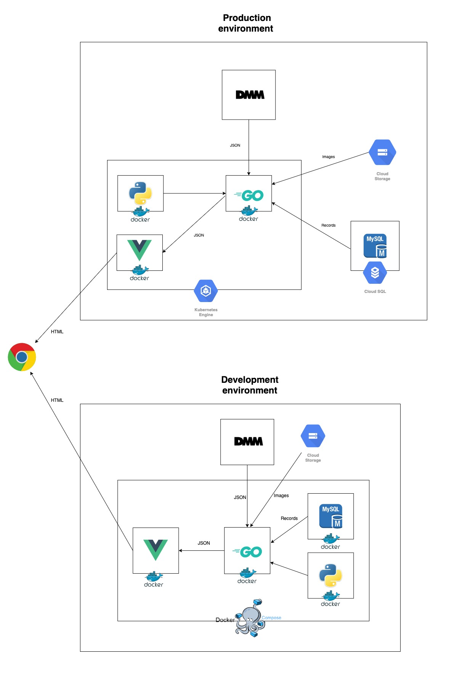

# AV ゼウス

あなたの好みの AV を AI がオススメしてくれる Web アプリです。

## お知らせ

※現在開発中です。

## 使い方

1. 表示された女性の写真の中から好みの人（最大 5 人まで）を選択
2. AI がその情報を元にあなた好みのオススメ AV を表示

## 環境

開発環境と本番環境はそれぞれ以下の図の通りです。
  
**【開発環境】**
Docker でマイクロサービス化させ、Docker Compose で連携させています。
  
**【本番環境】**
Docker でマイクロサービス化させ、Google Kubernetes Engine で連携させています。 
データベースは開発環境とは異なり、Docker 化せずに、Cloud SQL を使用しています。  

## 各サービスの GitHub リポジトリ

- **AI Engine**：[kantaso/ai-engine（仮）](#)
- **Backend**：[souhub/avzeus-backend](https://github.com/souhub/avzeus-backend)
- **Frontend**：[souhub/avzeus-frontend](https://github.com/souhub/avzeus-frontend)

## 使用技術

使った主な技術は以下のとおりです。

- Docker
- Docker Compose
- Go v1.15
- Python v3
- JavaScript
- Vue.js v3
- CSS
- MySQL v8.0.23
- Google Cloud Storage
- DMM API
