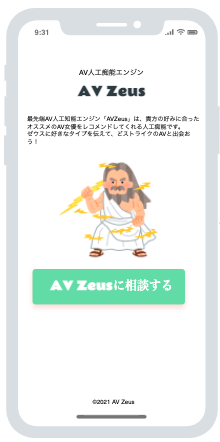
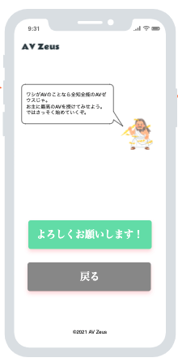
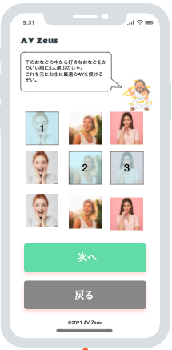
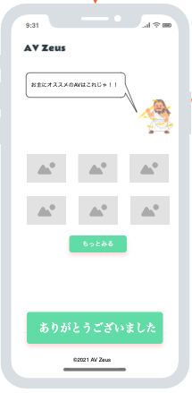
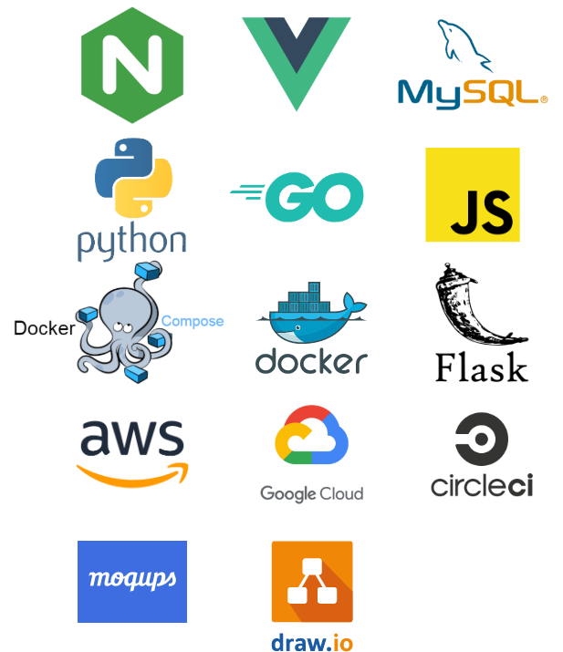
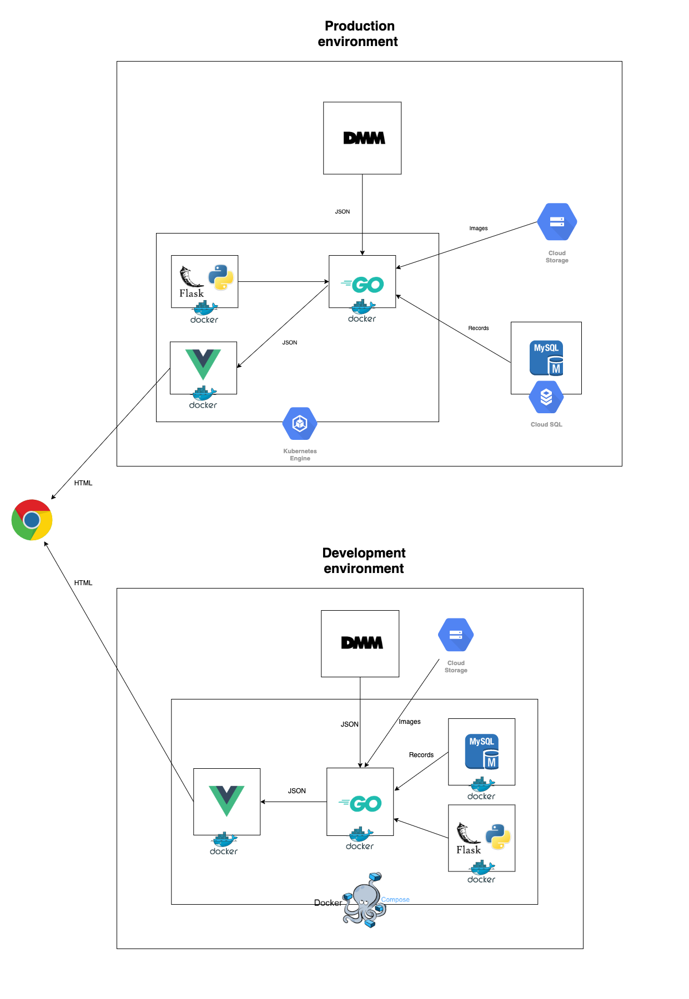

# AV ゼウス

あなたの好みの AV を AI がオススメしてくれる Web アプリです。

## お知らせ

~~※現在開発中です。~~  
2021/4/8 追記 
β 版をリリースしました。 

https://avzeus-client.mmu6fa6rgrojg.ap-northeast-1.cs.amazonlightsail.com/

## 各サービスの GitHub リポジトリ

- **AI Engine**：[Kan0620/avzeus-recommend_AI](https://github.com/Kan0620/avzeus-recommend_AI)
- **Backend**：[souhub/avzeus-backend](https://github.com/souhub/avzeus-backend)
- **Frontend**：[souhub/avzeus-frontend](https://github.com/souhub/avzeus-frontend)

## 使い方

1. トップページ  
   トップページです。ボタンを押して始めます。  
    

2. 説明ページ  
   説明ページです。使い方の説明を簡単に行います。  
    

3. 選択ページ  
   表示された女性の写真の中から好みの人を 5 人選択します。  
    

4. 結果ページ  
   AI が選択された情報を元にあなた好みのオススメ AV を表示します。 
   AI は確率考慮と強化学習を行うため、同じ結果を入力しても結果が異なる場合もあります。  
    

## 使用技術

使った主な技術は以下のとおりです。  

- Docker v20.10.5
- Docker Compose v1.28.5
- Go v1.15
- Python v3.9.0
- JavaScript
- Flask v1.1.2
- Vue.js v3
- Nginx
- MySQL v8.0.23
- Google Cloud Storage
- Amazon Lightsail
- CircleCI
- moqups
- draw.io

## 環境

開発環境と本番環境はそれぞれ以下の図の通りです。
  
**【開発環境】** 
Docker で下図のように 4 つのサーバーに分け、Docker Compose で連携させています。  
**【本番環境】** 
下図のように 3 つのサーバーにわけています。 
データベースは開発環境とは異なり、Docker 化せずに、Loghtsail データベース を使用しています。  

